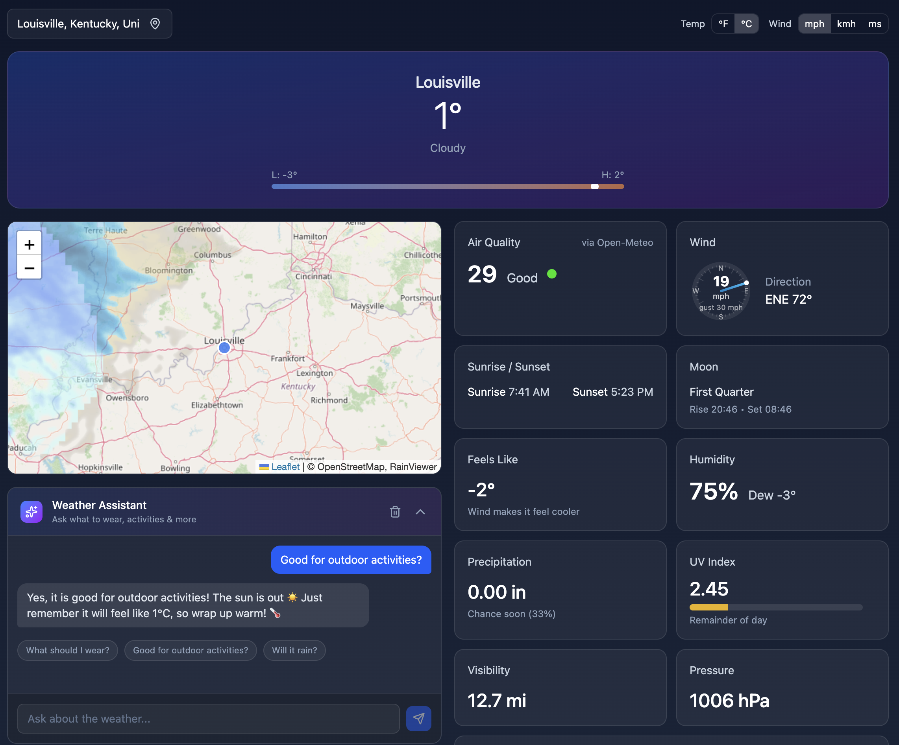
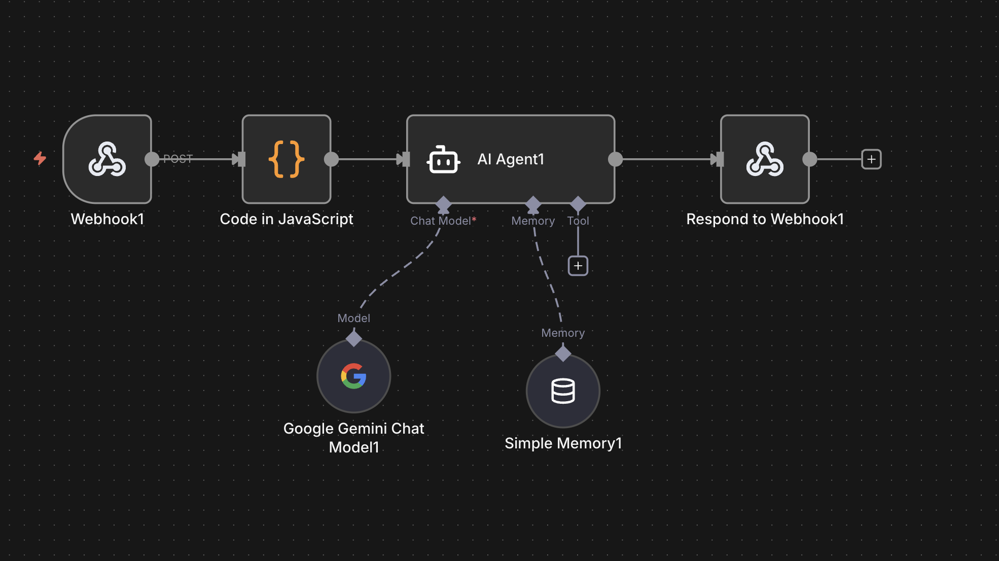

# RainDrop 🌧️

A modern, responsive weather application with AI-powered assistant, built with React and TypeScript.


## 📸 Screenshots

### Application Interface


### n8n AI Workflow


## ✨ Features

### Weather Data
- **Real-time weather** — Current conditions with temperature, humidity, wind, and more
- **7-day forecast** — Extended forecast with highs, lows, and precipitation chances
- **Air quality index** — EPA AQI with health recommendations
- **UV index** — Sun exposure levels and protection advice
- **Sunrise/Sunset** — Daily solar times
- **Moon phases** — Current lunar phase with moonrise/moonset

### Interactive Map
- **Radar overlay** — Live precipitation radar from RainViewer
- **Location marker** — Visual indicator for selected city
- **Playback controls** — Animate recent radar history

### AI Weather Assistant
- **Natural language queries** — Ask "What should I wear today?"
- **Context-aware responses** — Uses current weather data for accurate advice
- **Activity suggestions** — Outdoor activity recommendations based on conditions
- **Conversation memory** — Remembers context within a session
- **Rate limiting** — IP-based protection (30 requests/hour)

### User Experience
- **City search** — Geocoding-powered location search
- **Unit toggle** — Switch between °C/°F and mph/kmh/ms
- **Responsive design** — Optimized for desktop and mobile
- **Persistent preferences** — Saves your location and settings

## 🏗️ Architecture

### System Overview

```
┌─────────────────────────────────────────────────────────────────┐
│                         Frontend (React)                        │
│  ┌─────────┐ ┌──────────┐ ┌─────────┐ ┌──────────┐ ┌─────────┐ │
│  │ Weather │ │   Map    │ │   AI    │ │ Forecast │ │ Details │ │
│  │  Hero   │ │ (Leaflet)│ │  Chat   │ │  List    │ │  Cards  │ │
│  └────┬────┘ └────┬─────┘ └────┬────┘ └────┬─────┘ └────┬────┘ │
│       │           │            │           │            │       │
│       └───────────┴─────┬──────┴───────────┴────────────┘       │
│                         │                                        │
│              ┌──────────▼──────────┐                            │
│              │  React Query Cache  │                            │
│              └──────────┬──────────┘                            │
└─────────────────────────┼───────────────────────────────────────┘
                          │
        ┌─────────────────┼─────────────────┐
        │                 │                 │
        ▼                 ▼                 ▼
┌───────────────┐ ┌───────────────┐ ┌───────────────┐
│  Open-Meteo   │ │  RainViewer   │ │  n8n Cloud    │
│  (Weather)    │ │  (Radar)      │ │  (AI Chat)    │
└───────────────┘ └───────────────┘ └───────┬───────┘
                                            │
                                            ▼
                                    ┌───────────────┐
                                    │ Google Gemini │
                                    │    (LLM)      │
                                    └───────────────┘
```

### n8n Workflow Architecture

The AI assistant uses a serverless n8n workflow with intelligent request handling:

```
Webhook (POST) → Code (Rate Limit + Parse) → AI Agent → Respond to Webhook
                                                │
                                    ┌───────────┴───────────┐
                                    │                       │
                              Google Gemini          Simple Memory
                              (Chat Model)           (Session-based)
```

**Workflow Components:**

| Node | Purpose |
|------|---------|
| **Webhook** | Receives POST requests with message + weather data |
| **Code** | IP-based rate limiting (30/hour), request validation, data formatting |
| **AI Agent** | Processes queries with weather context and system instructions |
| **Gemini Model** | Google's Gemini 2.0 Flash for fast, accurate responses |
| **Simple Memory** | Session-based conversation memory using client sessionId |
| **Respond to Webhook** | Returns JSON with AI message and follow-up suggestions |

## 🛠️ Tech Stack

| Category | Technologies |
|----------|-------------|
| **Frontend** | React 18, TypeScript 5, Vite 7 |
| **Styling** | Tailwind CSS 4, Framer Motion |
| **State** | Zustand (with persistence), React Query |
| **Maps** | Leaflet, react-leaflet |
| **Validation** | Zod |
| **AI Backend** | n8n, Google Gemini 2.0 Flash |

## 📡 Data Sources

| Data | Source | Cost |
|------|--------|------|
| Weather forecast | [Open-Meteo](https://open-meteo.com/) | Free |
| Air quality | [Open-Meteo Air Quality](https://open-meteo.com/en/docs/air-quality-api) | Free |
| Geocoding | [Open-Meteo Geocoding](https://open-meteo.com/en/docs/geocoding-api) | Free |
| Radar tiles | [RainViewer](https://www.rainviewer.com/api.html) | Free |
| AQI (US) | [AirNow](https://www.airnow.gov/) | Free |

## 🚀 Quick Start

### Prerequisites
- Node.js 18+ (recommended: 20 LTS)
- npm 9+

### Installation

```bash
# Clone the repository
git clone https://github.com/TheZZak/RainDrop.git
cd RainDrop

# Install dependencies
npm ci

# Start development server
npm run dev
```

Open [http://localhost:5173](http://localhost:5173) in your browser.

### Production Build

```bash
npm run build
npm run preview
```

## 🤖 AI Assistant Setup (n8n)

### Quick Import

1. Sign up at [n8n.cloud](https://n8n.cloud/) (free tier: 2,500 executions/month)
2. Create a new workflow
3. Import `templates/n8n/weather-assistant-workflow.json`
4. Add your Google Gemini API credentials
5. Activate the workflow
6. **Update webhook URL** in `src/lib/n8n.ts`:

```typescript
// Change this to your n8n instance URL
const N8N_BASE = isDev ? '/api/n8n' : 'https://YOUR-INSTANCE.app.n8n.cloud';
```

> **Note:** The webhook path is `weather-chat`, so your full URL will be:
> `https://YOUR-INSTANCE.app.n8n.cloud/webhook/weather-chat`

### Manual Setup

<details>
<summary>Click to expand manual setup instructions</summary>

#### 1. Create Webhook Node
- HTTP Method: `POST`
- Path: `weather-chat`
- Response Mode: `Using 'Respond to Webhook' Node`

#### 2. Create Code Node (Rate Limiting)
```javascript
const staticData = $getWorkflowStaticData('global');
if (!staticData.requests) staticData.requests = {};

const body = $input.first().json.body;
const ip = $('Webhook1').item.json.headers['x-forwarded-for'] || 'unknown';
const now = Date.now();
const ONE_HOUR = 3600000;
const MAX_REQUESTS = 30;

// Clean old entries & check rate limit
for (const key in staticData.requests) {
  if (now - staticData.requests[key].timestamp > ONE_HOUR) delete staticData.requests[key];
}

if (!staticData.requests[ip]) staticData.requests[ip] = { count: 0, timestamp: now };
const ipData = staticData.requests[ip];
if (now - ipData.timestamp > ONE_HOUR) { ipData.count = 0; ipData.timestamp = now; }
if (ipData.count >= MAX_REQUESTS) {
  return [{ json: { rateLimited: true, message: 'Rate limit exceeded.' } }];
}
ipData.count++;

// Validate & format
if (!body.message || !body.weather?.location) throw new Error('Invalid request');

const weather = body.weather;
return [{
  json: {
    rateLimited: false,
    sessionId: body.sessionId,
    chatInput: body.message,
    location: weather.location,
    weatherData: `Current Weather for ${weather.location}:
- Temperature: ${weather.temperature}°C (feels like ${weather.feelsLike}°C)
- Condition: ${weather.condition}
- Humidity: ${weather.humidity}%
- Wind: ${weather.windSpeed} km/h
- Rain Chance: ${weather.precipitationChance}%
- UV Index: ${weather.uvIndex}
Today: ${weather.todayLow}°C - ${weather.todayHigh}°C`
  }
}];
```

#### 3. Create AI Agent Node
- Text: `{{ $json.chatInput }}`
- System Message:
```
You are a Weather Assistant for {{ $json.location }}. Help with weather questions ONLY.

RULES:
- Only answer weather, clothing, outdoor activity questions
- For other topics, politely decline
- Use the weather data provided
- Be friendly, use emojis 🌡️ ☀️ 🌧️ 💨 👕

WEATHER DATA:
{{ $json.weatherData }}
```

#### 4. Add Google Gemini Chat Model
- Model: `models/gemini-2.0-flash`
- Connect to AI Agent (Chat Model slot)

#### 5. Add Simple Memory
- Session ID Type: `Custom Key`
- Session Key: `{{ $('Webhook1').item.json.body.sessionId }}`
- Connect to AI Agent (Memory slot)

#### 6. Create Respond to Webhook Node
- Respond With: `JSON`
- Response Body:
```
{{ JSON.stringify({ message: $json.output, suggestions: ['What should I wear?', 'Good for outdoor activities?', 'Will it rain?'] }) }}
```

</details>

## 📁 Project Structure

```
src/
├── components/
│   ├── cards/              # Weather detail cards (12 cards)
│   ├── Header.tsx          # City name & current temp
│   ├── RadarMap.tsx        # Leaflet map with radar overlay
│   ├── SearchBox.tsx       # City search with geocoding
│   ├── WeatherChat.tsx     # AI assistant UI
│   └── ...
├── hooks/
│   ├── useWeatherData.ts   # Weather data fetching & caching
│   └── useWeatherChat.ts   # AI chat state management
├── lib/
│   ├── openmeteo.ts        # Open-Meteo API client
│   ├── n8n.ts              # n8n webhook client
│   ├── weatherContext.ts   # AI context builder
│   ├── climate.ts          # Climate normals
│   └── ...
├── store/
│   ├── useLocation.ts      # Location state (persisted)
│   └── usePreferences.ts   # User preferences (persisted)
└── App.tsx                 # Main app component
```

## 🌐 Deployment

### GitHub Pages (Recommended)

1. Push to GitHub
2. Go to repo **Settings** → **Pages**
3. Source: **GitHub Actions**
4. Auto-deploys on push to `main`

**Live URL:** `https://<username>.github.io/RainDrop/`

### Other Platforms

Build and deploy the `dist/` folder:

| Platform | Command |
|----------|---------|
| Vercel | `vercel --prod` |
| Netlify | Drag & drop `dist/` |
| Cloudflare Pages | Connect repo |

## 🔒 Security

- **Rate Limiting** — 30 requests per IP per hour (configurable in n8n)
- **Input Validation** — All requests validated before processing
- **No API Keys Exposed** — Weather APIs are free/public, n8n handles LLM credentials
- **Session Isolation** — Each user gets isolated conversation memory

## 📜 License

MIT License — see [LICENSE](LICENSE) for details.

## 🙏 Acknowledgments

- [Open-Meteo](https://open-meteo.com/) — Free weather API
- [RainViewer](https://www.rainviewer.com/) — Radar data
- [n8n](https://n8n.io/) — Workflow automation
- [Google Gemini](https://ai.google.dev/) — AI model
- [Leaflet](https://leafletjs.com/) — Interactive maps

